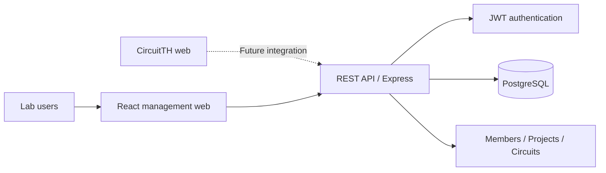

# Lab Manager Architecture

## REST resources

- `POST /api/auth/login`
- `GET /api/auth/me`
- `GET|POST /api/members`
- `PATCH|DELETE /api/members/:id`
- `GET|POST /api/projects`
- `GET|POST /api/circuits`
- `GET|PUT|DELETE /api/circuits/:id`

## CircuitTH integration

CircuitTH will replace IndexedDB-only persistence with the circuit endpoints. `schematic` stores the current `{ components, wires }` object and `sim_config` stores simulation settings. IndexedDB can remain as an offline cache.
